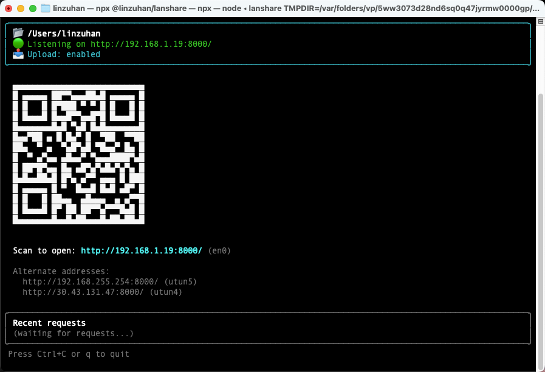

# LanShare

> Share a folder over your LAN via HTTP, with a scannable QR code and phone-to-PC upload — zero config, zero browser plugin, zero cloud.

[](https://www.npmjs.com/package/@linzuhan/lanshare)
[](https://nodejs.org/)
[](LICENSE)

<p align="center">
  
</p>

[简体中文](#简体中文) · English

---

## ✨ Features

- 🚀 **Zero config** — one command shares any folder on your LAN.
- 📱 **QR code in the terminal** — point your phone's camera, no typing IPs.
- 📤 **Phone → PC upload** — pick or drop files from your phone, land them in whatever folder you're browsing. Same-name conflicts get a clear three-choice dialog (keep both / overwrite / skip).
- 🌐 **Smart interface picking** — auto-detects multi-NIC machines, prefers real LAN ranges (`192.168.x.x`, `10.x.x.x`), deprioritizes VPN/tunnel interfaces (`utun`, `tun`, `tap`, `ipsec`, `ppp`, `wg`).
- 🔌 **Auto port fallback** — starting port busy? It tries the next one (up to 100).
- 🖥️ **Interactive TUI** — live request log via [ink](https://github.com/vadimdemedes/ink) + React; falls back to plain output in non-TTY environments.
- 🪶 **Tiny dep footprint** — `serve-handler` + `busboy` + `qrcode-terminal` + `commander`. No bundler, no native modules.

## 📦 Install

Requires Node.js `>= 18`.

```bash
# One-shot — no install
npx @linzuhan/lanshare

# Or install globally
npm install -g @linzuhan/lanshare
```

## 🚀 Quick start

```bash
# Share the current folder (port starts at 8000, auto-increments if taken)
lanshare

# Share a specific folder
lanshare ./public

# Custom port
lanshare ./public -p 9000

# Bind to a specific LAN IP
lanshare ./public -h 192.168.1.10

# Read-only — no uploads allowed
lanshare ./public --no-upload

# Cap each upload to 500MB (default: 5GB; pass 0 for unlimited)
lanshare ./public --max-upload-size 500m

# Skip the QR code (non-TTY use: scripts, CI, logs)
lanshare ./public --no-qr
```

The terminal prints the primary URL, alternates, an upload status line, and a QR code. Scan from a phone on the same Wi-Fi and you're in. `Ctrl+C` to stop.

## 📤 Uploading from your phone

When upload is enabled (the default), every directory page on the phone has an upload zone at the bottom:

- Tap to pick files, or drag-and-drop.
- Files land in the folder you're currently browsing — go into a subfolder first if that's where you want them.
- If a name collides, a modal asks: **Keep both** (adds `(1)`, `(2)`, … suffix) / **Overwrite** / **Skip**. Tick "apply to remaining" to batch the rest.
- Server-side, uploads stream through [busboy](https://github.com/mscdex/busboy) and write atomically (temp file + rename), so a crash or `Ctrl+C` mid-upload won't leave half-written files in your shared folder.

Pass `--no-upload` to disable the endpoint entirely (returns HTTP 405).

## ⚠️ Security notes

LanShare is built for **trusted local networks** — your home Wi-Fi, a co-working space you control, an office subnet. It is intentionally simple:

- **No authentication.** Anyone on the same network who reaches the URL can browse and (unless `--no-upload`) write to the shared folder.
- **No HTTPS.** Traffic is plain HTTP.
- **Path traversal is blocked** (uploads and listings both reject `../` and absolute paths), but you should still point it at a specific folder, not your home directory or `/`.

**Don't** expose the port to the public internet, run it on coffee-shop Wi-Fi without `--no-upload`, or share folders containing secrets.

## 🛠️ CLI reference

| Flag                          | Description                                                        | Default     |
| ----------------------------- | ------------------------------------------------------------------ | ----------- |
| `[dir]`                       | Folder to share                                                    | `cwd`       |
| `-p, --port <number>`         | Starting port (auto-increments if busy, up to 100 tries)           | `8000`      |
| `-h, --host <ip>`             | Bind to a specific LAN IP (must match a real local interface)      | auto-picked |
| `--no-qr`                     | Don't render the QR code (use for non-TTY output)                  | render      |
| `--no-upload`                 | Disable uploads (read-only)                                        | enabled     |
| `--max-upload-size <size>`    | Per-file upload cap. Accepts `500k`, `200m`, `2g`; `0` = unlimited | `5g`        |
| `-V, --version`               | Print version                                                      |             |
| `--help`                      | Print help                                                         |             |

## 🧱 How it works

```
src/
├── cli.ts        # arg parsing, LAN address pick, port pick, server boot, TUI render
├── server.ts     # HTTP server: routes /__upload, /__check, custom listings → serve-handler
├── upload.ts     # busboy streaming, conflict policy, path-traversal-safe writes
├── listing.ts    # custom directory listing HTML (with inline upload UI)
├── network.ts    # NIC enumeration + priority sort (deprioritize tunnels)
├── port.ts       # findFreePort
├── qr.ts         # qrcode-terminal wrapper
└── ui/           # Ink + React TUI
test/             # vitest unit + e2e (real HTTP via random ports)
```

## 🧑‍💻 Development

```bash
npm install
npm run dev          # tsx src/cli.ts
npm run typecheck    # tsc --noEmit
npm test             # vitest run
npm run test:watch
npm run build        # tsup → dist/cli.js
```

PRs and issues welcome at [github.com/ZuhanLin/lanshare](https://github.com/ZuhanLin/lanshare).

## 📄 License

[MIT](LICENSE) © linzuhan

---

## 简体中文

> 轻量级局域网文件共享 CLI：把本地文件夹通过 HTTP 暴露在 LAN 中，终端打印可扫描的二维码，手机扫码即可浏览下载 —— 还能反过来把手机上的文件传到电脑里。

### ✨ 特性

- 🚀 **零配置** —— 一行命令就能在 LAN 里分享任意目录
- 📱 **终端二维码** —— 手机相机一扫即用，不用手敲 IP
- 📤 **手机 → 电脑上传** —— 在手机浏览器选文件或拖拽，落到当前正在浏览的目录里；重名时弹窗提示「保留两者 / 覆盖 / 跳过」
- 🌐 **智能选址** —— 多网卡环境优先选真实内网 IP（`192.168.x.x`、`10.x.x.x`），自动降权 VPN/隧道接口（`utun`、`tun`、`wg` 等）
- 🔌 **端口自动顺延** —— 起始端口被占用时自动 +1，最多探测 100 个
- 🖥️ **交互式 TUI** —— Ink + React 渲染，实时显示请求日志；非 TTY 环境自动降级为纯文本输出
- 🪶 **依赖精简** —— 仅 `serve-handler` + `busboy` + `qrcode-terminal` + `commander`，无构建产物，无原生模块

### 📦 安装

需要 Node.js `>= 18`。

```bash
# 免安装直接跑
npx @linzuhan/lanshare

# 或全局安装
npm install -g @linzuhan/lanshare
```

### 🚀 快速开始

```bash
# 分享当前目录（默认端口 8000，被占用自动顺延）
lanshare

# 分享指定目录
lanshare ./public

# 指定端口
lanshare ./public -p 9000

# 绑定指定 LAN IP
lanshare ./public -h 192.168.1.10

# 只读模式，禁用上传
lanshare ./public --no-upload

# 限制单文件最大 500MB（默认 5g，传 0 表示不限）
lanshare ./public --max-upload-size 500m

# 不打印二维码（适合 CI/日志场景）
lanshare ./public --no-qr
```

### 📤 手机上传

默认启用。手机访问目录页时底部会有一个上传区：

- 点击选文件，或直接把文件拖进去
- 文件会落到**当前浏览的那个目录**里 —— 想传到子目录就先点进去再传
- 同名冲突会弹窗：**保留两者**（加 `(1)`、`(2)` 后缀）/ **覆盖** / **跳过**；可勾选「应用到剩余冲突」批量处理
- 服务端用 [busboy](https://github.com/mscdex/busboy) 流式解析 + 临时文件原子重命名，半截上传中断也不会留下脏文件

加 `--no-upload` 可彻底关闭上传端点（POST 会返回 405）。

### ⚠️ 安全提醒

LanShare 是给**可信局域网**用的 —— 家里 Wi-Fi、自己控制的工位、办公子网。它故意做得很简单：

- **没有鉴权**：同网段下能访问到 URL 的人都能浏览、上传
- **没有 HTTPS**：明文传输
- 路径穿越虽然做了防御（上传和列表都拒绝 `../` 和绝对路径），但仍然建议指向一个具体目录，不要直接分享 `~` 或 `/`

**别**把端口暴露到公网，**别**在咖啡店 Wi-Fi 上开着上传，**别**分享含敏感数据的目录。

### 📄 License

[MIT](LICENSE) © linzuhan
